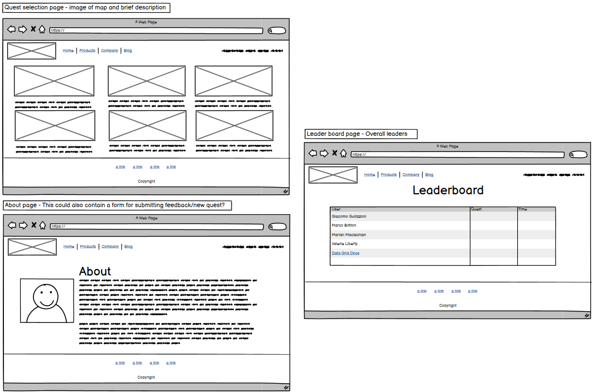

# Run Wild

## Overview

### Purpose
Run Wild is a web-based platform designed to gamify the running experience and foster a community of active runners through a token-based reward system. The platform transforms everyday runs into rewarding achievements by allowing runners to earn tokens based on their performance, creating an engaging and motivating environment for consistent physical activity.

#### Objectives:

1. **Motivate Regular Exercise**: By implementing a token reward system, the platform encourages users to maintain consistent running haibits.
2. **Foster Competition**: Create healthy competition through a global leaderboard system that recognises both dedication and performance.
3. **Build Community**: Develop a space where runners can compete and compare their achievements with others, creating a sense of belonging and mutual motivation.

#### Value Proposition:

- Transforms routine running activities into rewarding experiences
- Provides immediate feedback and recognition for running achievements
- Creates a structured system for tracking progress and improvement
- Offers a competitive element that maintains long-term engagement
- Delivers a simple, streamlined experience focused on running metrics that matter

### Target Audience

#### Primary Audience: Recreational Runners

- Age Range: 18+ years old
- Running Experience: Beginner to intermediate runners
- Motivation: Seeking additional motivation and structure in their running routine

#### 1. Beginner Runners
- Looking for motivation to establish consistent running habits
- Interested in tracking progress and improvement
- Need positive reinforcement to maintain commitment
- Value clear metrics and achievable goals
  
#### 2. Regular Runners
- Seeking new ways to stay motivated
- Interested in competing with others
- Want to track their performance metrics
- Looking for recognition of their efforts

#### 3. Challenge-Driven Individuals
- Motivated by competition and achievements
- Enjoy collecting rewards and tracking statistics
- Like to compare their performance with others
- Appreciate structured goal systems

### Why They Will Benefit:

#### Motivation Through Rewards

- Immediate gratification through token earnings
- Visual representation of progress
- Clear connection between effort and rewards

#### Progress Tracking

- Detailed run history
- Performance metrics tracking
- Clear visibility of improvement over time

#### Community Engagement

- Global leaderboard participation
- Competitive element
- Sense of belonging to a running community

#### Accessibility

- Simple, user-friendly interface
- Clear token earning structure
- Easy submission process for runs

### User Needs Addressed:

- Need for motivation to maintain regular running habits
- Desire for recognition of running achievements
- Want for structured progress tracking
- Interest in competing with other runners
- Requirement for simple, straightforward run logging

The aim of this web app is to specifically addresses the growing trend of gamification in fitness applications whilst maintaining a focus on simplicity and user engagement. By combining traditional run tracking with a reward system, Run Wild creates a unique value proposition for runners who are looking for additional motivation and structure in their running routine.

## User Stories

### Must-Have User Stories
- **User Story 1:** Briefly describe the must-have feature.  
  **Acceptance Criteria:** List the criteria that define the successful implementation of this user story.
- **User Story 2:** Briefly describe the must-have feature.  
  **Acceptance Criteria:** List the criteria that define the successful implementation of this user story.

(Include all prioritized must-have features)  
**Guidance:** Draft the user stories during Phase 1: Ideation & Initial Setup and update them as you complete Phase 2: Must User Stories Implementation & Testing. Document each must-have feature here along with its acceptance criteria.

### Should-Have User Stories
- **User Story 1:** Briefly describe the should-have feature.  
  **Acceptance Criteria:** List the criteria that define the successful implementation of this user story.
- **User Story 2:** Briefly describe the should-have feature.  
  **Acceptance Criteria:** List the criteria that define the successful implementation of this user story.

(Include all prioritized should-have features)  
**Guidance:** Document the secondary features that you aim to implement in Phase 3: Should User Stories Implementation & Any Advanced Features. Include clear acceptance criteria for each.

### Could-Have User Stories
- **User Story 1:** Briefly describe the could-have feature.  
  **Acceptance Criteria:** List the criteria that define the successful implementation of this user story.
- **User Story 2:** Briefly describe the could-have feature.  
  **Acceptance Criteria:** List the criteria that define the successful implementation of this user story.

(Include any could-have features considered for future enhancements)  
**Guidance:** Document any optional features that are nice to have but not essential.

## Design Decisions

### Wireframes

### Desktop

 ### Mobile

### Tablet

Briefly describe the design choices, including layout, colour schemes, and fonts.  
**Guidance:** Start this section during Phase 1: Ideation & Initial Setup and update it throughout Phase 2 and Phase 3. Include digital wireframes created in Phase 1. Document the reasoning behind your layout choices, colour schemes, and font selections.

### Accessibility Considerations
Discuss how accessibility guidelines were adhered to, including colour contrast and alt text for images.  
**Guidance:** Outline how you've incorporated accessibility into your design, ensuring that your project adheres to guidelines such as WCAG.

## AI Tools Usage

### DALL-E
Describe how DALL-E was used for image generation, including examples of successes and challenges.  
**Guidance:** Specifically mention how you used DALL-E for image generation and the impact this had on your design process.

## Features Implementation

### Core Features (Must-Haves)
- **Feature 1:** Description of the implemented feature.
- **Feature 2:** Description of the implemented feature.

(Include all must-have features)  
**Guidance:** Use this section as you complete Phase 2: Must User Stories Implementation & Testing. Document all the must-have features you implemented, explaining how they align with the user stories and acceptance criteria.

### Advanced Features (Should-Haves)
- **Feature 1:** Description of the implemented feature.
- **Feature 2:** Description of the implemented feature.

(Include all should-have features)  
**Guidance:** Include any advanced features you implemented during Phase 3: Should User Stories Implementation & Any Advanced Features. Explain how these features enhance user experience and their alignment with the acceptance criteria.

### Optional Features (Could-Haves)
- **Feature 1:** Description of the implemented feature (if any).
- **Feature 2:** Description of the implemented feature (if any).

(Include any could-have features that were implemented or considered)  
**Guidance:** If any could-have features were implemented, describe them here. This is an opportunity to showcase extra work done beyond the initial scope. But remember - keep it simple! Focus on the Must stories first. Could user story features are commonly earmarked for future project iterations.

## AI Tools Usage

### GitHub Copilot
Describe how GitHub Copilot assisted in coding, including any challenges or adjustments needed.  
**Guidance:** Reflect on how GitHub Copilot assisted in coding, particularly any challenges or adjustments that were needed to align with project goals.

## Testing and Validation

### Testing Results
Summarize the results of testing across different devices and screen sizes.  
Mention any issues found and how they were resolved.  
**Guidance:** Summarize the results of your testing across various devices using tools like Chrome DevTools, as outlined in Phase 2. Mention any issues found and how they were resolved.

### Validation
Discuss the validation process for HTML and CSS using W3C and Jigsaw validators.  
Include the results of the validation process.  
**Guidance:** Document your use of W3C and Jigsaw validators to ensure your HTML and CSS meet web standards. Include any errors or warnings encountered and how they were resolved.

## AI Tools Usage

### GitHub Copilot
Brief reflection on the effectiveness of using AI tools for debugging and validation.  
**Guidance:** Reflect on how GitHub Copilot assisted with debugging and validation, particularly any issues it helped resolve.

## Deployment

### Deployment Process
Briefly describe the deployment process to GitHub Pages or another cloud platform.  
Mention any specific challenges encountered during deployment.  
**Guidance:** Describe the steps you took to deploy your website during Phase 4: Final Testing, Debugging & Deployment, including any challenges encountered.

## AI Tools Usage

### Reflection
Describe the role AI tools played in the deployment process, including any benefits or challenges.  
**Guidance:** Reflect on how AI tools assisted with the deployment process, particularly how they streamlined any tasks or presented challenges.

## Reflection on Development Process

### Successes
Effective use of AI tools, including GitHub Copilot and DALL-E, and how they contributed to the development process.

### Challenges
Describe any challenges faced when integrating AI-generated content and how they were addressed.

### Final Thoughts
Provide any additional insights gained during the project and thoughts on the overall process.  
**Guidance:** Begin drafting reflections during Phase 1 and update throughout the project. Finalize this section after Phase 4. Highlight successes and challenges, particularly regarding the use of AI tools, and provide overall insights into the project.

## Code Attribution
Properly attribute any external code sources used in the project (excluding GitHub Copilot-generated code).  
**Guidance:** Document any external code sources used throughout the entire project, especially during Phase 2 and Phase 3. Exclude GitHub Copilot-generated code from attribution.

## Future Improvements
Briefly discuss potential future improvements or features that could be added to the project.  
**Guidance:** Reflect on potential enhancements that could be made to the project after Phase 4: Final Testing, Debugging & Deployment. These could be Could user story features you didn’t have time to implement or improvements based on testing feedback.