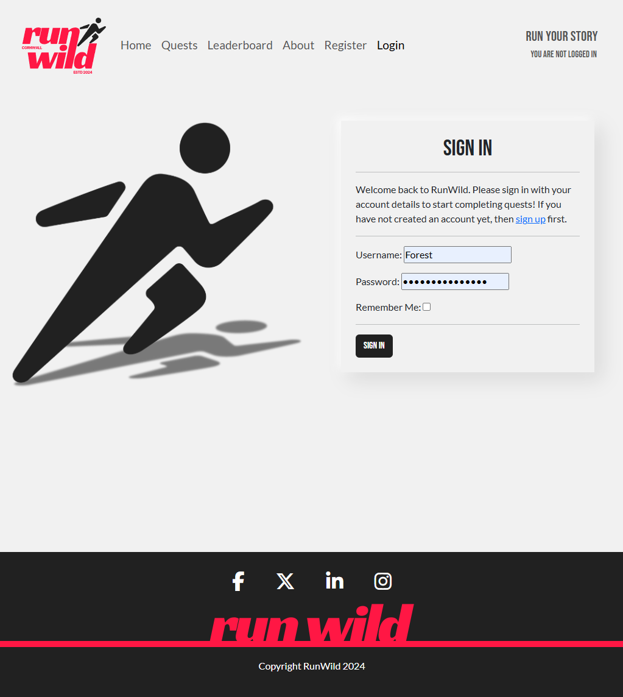
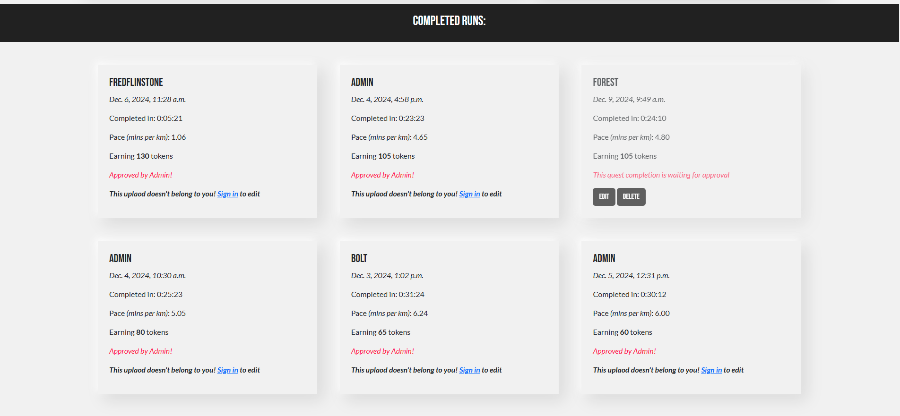
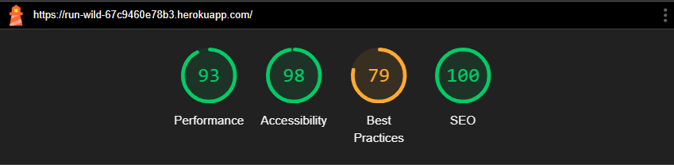

# Run Wild


## Overview

[Live Project](https://run-wild-67c9460e78b3.herokuapp.com/)

### Purpose
Run Wild is a web-based platform designed to gamify the running experience and foster a community of active runners through a token-based reward system. The platform transforms everyday runs into rewarding achievements by allowing runners to earn tokens based on their performance, creating an engaging and motivating environment for consistent physical activity.

<details>
<summary>Objectives</summary>

1. **Motivate Regular Exercise**: By implementing a token reward system, the platform encourages users to maintain consistent running haibits.
2. **Foster Competition**: Create healthy competition through a global leaderboard system that recognises both dedication and performance.
3. **Build Community**: Develop a space where runners can compete and compare their achievements with others, creating a sense of belonging and mutual motivation.

</details>

<details>
<summary>Value Proposition</summary>

- Transforms routine running activities into rewarding experiences
- Provides immediate feedback and recognition for running achievements
- Creates a structured system for tracking progress and improvement
- Offers a competitive element that maintains long-term engagement
- Delivers a simple, streamlined experience focused on running metrics that matter

</details>

### Target Audience

<details>
<summary>Recreational Runners</summary>

- Age Range: 18+ years old
- Running Experience: Beginner to intermediate runners
- Motivation: Seeking additional motivation and structure in their running routine

</details>

<details>
<summary>Beginner Runners</summary>

- Looking for motivation to establish consistent running habits
- Interested in tracking progress and improvement
- Need positive reinforcement to maintain commitment
- Value clear metrics and achievable goals
  
</details>

<details>
<summary>Regular Runners</summary>

- Seeking new ways to stay motivated
- Interested in competing with others
- Want to track their performance metrics
- Looking for recognition of their efforts

</details>

<details>
<summary>Challenge-Driven Individuals</summary>

- Motivated by competition and achievements
- Enjoy collecting rewards and tracking statistics
- Like to compare their performance with others
- Appreciate structured goal systems

</details>

### Why They Will Benefit?

<details>
<summary>Motivation Through Rewards</summary>

- Immediate gratification through token earnings
- Visual representation of progress
- Clear connection between effort and rewards

</details>

<details>
<summary>Progress Tracking</summary>

- Detailed run history
- Performance metrics tracking
- Clear visibility of improvement over time

</details>

<details>
<summary>Community Engagement</summary>

- Global leaderboard participation
- Competitive element
- Sense of belonging to a running community

</details>

<details>
<summary>Accessibility</summary>

- Simple, user-friendly interface
- Clear token earning structure
- Easy submission process for runs

</details>

### User Needs Addressed:

- Need for motivation to maintain regular running habits
- Desire for recognition of running achievements
- Want for structured progress tracking
- Interest in competing with other runners
- Requirement for simple, straightforward run logging

The aim of this web app is to specifically addresses the growing trend of gamification in fitness applications whilst maintaining a focus on simplicity and user engagement. By combining traditional run tracking with a reward system, Run Wild creates a unique value proposition for runners who are looking for additional motivation and structure in their running routine.

## UX Design Process

### Strategy Plane
<hr>

<details>
<summary>User Stories</summary>

### Must Have Features

#### <u>Quest Management</u>

**User Story:** As a site user, I can view a paginated list of quests so that I can select which run I want to view. 

<details>
<summary>Acceptance Criteria:</summary>

- Given more than one quest in the database, these multiple quests are listed
- When a user opens the main page a list of quests is seen
- The user sees all quests titles with pagination to choose what to complete

</details>

#### <u>Run Tracking</u>

**User Story:** As a user I can submit my run details so that I can earn tokens

<details>
<summary>Acceptance Criteria:</summary>
  
- User can input completion time
- Submission process:
  - Confirms submission success
  - Displays tokens earned
- User can update and delete runs

</details>

#### <u>User Authentication</u>

**User Story:** As a registered user I can log into my account so that I can access my running history and tokens

<details>
<summary>Acceptance Criteria:</summary>
  
- User can log in using email/username and password

</details>

**User Story:** As a new user I want to register for an account so that I can track my runs and earn tokens

<details>
<summary>Acceptance Criteria:</summary>
  
- User can create account using email and password
- Profile is automatically created upon registration
- Initial token balance is set to 0
- Password must meet minimum security requirements:
  - At least 8 characters
  - Contains at least one number
  - Contains at least one special character

</details>

#### <u>Responsive Design</u>

**User Story:** As a user I want the site to be responsive so that I can use on any device

<details>
<summary>Acceptance Criteria:</summary>
  
- Site is usable on desktop, tablet, and mobile devices
- Layout adjusts appropriately to different screen sizes

</details>

#### <u>Accessibility</u>

**User Story:** As a User I require the site to be accessible so that I can utilise the website fully, regardless of potential visual impairments

<details>
<summary>Acceptance Criteria:</summary>
  
- Colour contrast, fonts, images and screen reading capabilities adhered to
- Good use of semantic elements

</details>

#### <u>Token System</u>

**User Story:** As a user I want to earn tokens so that can feel rewarded for my run

<details>
<summary>Acceptance Criteria:</summary>
  
- Token calculation:
  - Base rate: 10 tokens per km

- System must:
  - Calculate tokens instantly
  - Display calculation breakdown
  - Update user's total balance

- Transaction details include:
  - Date and time
  - Amount earned
  - Running total

- Notifications:
  - Immediate token earning notification

</details>

### Should Have Features

#### <u>Leaderboard</u>

**User Story:** As a user I want a leaderboard so that I can see how I rank against others

<details>
<summary>Acceptance Criteria:</summary>
  
- Leaderboard shows:
  - Total tokens earned
  - Total distance

- Privacy:
  - Only shows display user names

</details>

#### <u>Enhanced Token System</u>

**User Story:** As a user I want to have more token bonus so that I can gain more tokens

<details>
<summary>Acceptance Criteria:</summary>
  
- Pace bonuses:
  - Sub 4:00 min/km: +15 tokens/km
  - Sub 5:00 min/km: +10 tokens/km
  - Sub 6:00 min/km: +5 tokens/km


- Personal best bonus:
  - +5 tokens if personal best for route is achieved

- Difficulty bonus:
  - No bonus for easy
  - +5 for medium
  - +10 for hard

</details>

</details>

### Scope Plane
<hr>

<details>
<summary>Core Features:</summary>

- User authentication and profile management
- Running activity tracking and logging
- Token achievement system
- Leaderboards

</details>

### Structure Plane
<hr>

<details>
<summary>Logical structure</summary>

The application follows a logical structure where users can:

- Register/Login to access their personal dashboard
- Log and track running activities
- Earn tokens based on activity completion
- View their ranking on various leaderboards

</details>

### Skeleton Plane
<hr>

#### Wireframes

<details>
<summary>Desktop</summary>


</details>
<details>
<summary>Mobile</summary> 


</details>
<details>
<summary>Tablet</summary> 


</details>
<hr>
<details>
<summary>Database Schema</summary> 


</details>

### Surface Plane
<hr>

#### Design Chocies

<details>
<summary>Colour Scheme</summary> 
<br>
My color palette was chosen to reflect Run Wild's gamified running experience and token-based achievements, aiming to create a clean, modern and sporty user interface,
To acheive only one accent colour has been chosen. 
<br>
<br>


Off White (#fafdfb) - Primary Background

- Creates a soft, clean canvas that reduces eye strain
- Provides excellent contrast for text and interactive elements
- Maintains readability across different screen sizes and lighting conditions

Dark Gray (#212121) - Text Color

- Ensures optimal readability against the light background
- Softer than pure black, creating a more comfortable reading experience
- Meets WCAG accessibility standards for contrast

Vibrant Red (#ff1744) - Accent Color

- Creates visual excitement and energy
- Draws attention to important actions and achievements
- Represents passion and motivation in fitness

Pure White (#fff)

- Used for contrast on Dark Gray elements

</details>

<details>
<summary>Typography</summary> 
<br>
The typography combines two distinctive fonts to create a modern and energetic aesthetic while maintaining readability
<br>


<br>
Used for:

- Headlines
- Section titles
- Important numbers (statistics, achievements)

Characteristics:

- All-caps display font
- Strong visual impact
- Creates a bold, athletic feel
- Excellent for hierarchy and emphasis

<hr>
<br>


<br>

Used for:

- Body text
- Navigation items
- Form elements
- Secondary headings

Characteristics:

- High readability at all sizes
- Clean and modern sans-serif
- Excellent for long-form content
- Various weights for flexibility

##### Font Awesome

Icons: Font Awesome for intuitive navigation

</details>

<details>
<summary>Design Principles</summary>

##### 1. Clarity

- Clean layouts with ample white space
- Clear visual hierarchy
- Intuitive navigation


##### 2. Consistency

- Consistent colour usage across all pages
- Standardised spacing and alignment
- Uniform interactive elements


##### 2. Accessibility

- High contrast text-to-background ratios
- Clear focus states for navigation
- Readable font sizes and line heights


##### 2. Responsiveness

- Fluid typography scaling
- Flexible grid system
- Mobile-first approach to layout
<br>
<br>
This design system creates an energetic, modern interface that motivates users while maintaining excellent usability and accessibility standards.

</details>

## Features

<details>
<summary>Home Page</summary>

1. Welcome Section
   - Introduces the platform, emphasising gamified running and exploring Cornwall's scenic routes.
2. Call-to-Action
    - Encourages visitors to sign up or log in to start their running journey.
2. Number counters
    - provding a overview of all the completed quests so far.
3. About Us
    - Highlights the mission of turning running into an engaging and rewarding adventure.
4. Featured Routes
    - Bootstrap carosuaul used to showcases avaliable quests.
5. Key Benefits
    - Explains tokens, challenges, and leaderboards for motivation and fun.


</details>

<hr>
<details>
<summary>User Authentication</summary>

1. Sign-Up Functionality
    - Users can create accounts to access features like their dashboard, and Run Tracking functionality.
2. Login System
    - Secure login allows users to resume their progress and view completed quests.
3. Login in Status
    - In the top right, the status of user is displayed.
4. Role Based functionality
    - Admin pannel link only availible when you are signed in as a superuser.
5. User Messages
    - Message pop ups giving user further claification on action completed for all user Authentication actions





</details>
<hr>

<details>
<summary>About Page</summary>

1. Platform Mission

- Highlights the goal of turning running into an adventurous and rewarding experience.

2. Community Focus

- Emphasizes building a network of runners who share routes and challenges.

3. Inspiration

- Explains the origins and purpose behind the creation of RunWild.

4. Route Submission Form

- Provides a form for users to contribute new running routes, fostering collaboration.


</details>
<hr>
<details>
<summary>Quest Management</summary>

1. Avalibale Quest
    - Pagination for avalible quests for the user to select, reachable in the navigation.
2. Quest Details
    - Quest overview - breif descirption of route and image showing markers for route.
    - Difficulity, Distance, Elevation gain and Max displayed so user can assess if they are able to acheive.
    - Total Quests complete and Top 5 uploads displayed on each Quest Post.
    - Details of Completed runs shown, authenticated users can also access CRUD functionality here.
     





</details>
<hr>
<details>
<summary>Run Tracking</summary>

CRUD functionality - The user is able to upload, edit and delete their uploads on the quest page.


</details>
<hr>

<details>
<summary>Leaderboards</summary>
Pagination for avalible quests for the user to select, reachable in the navigation.


</details>
<hr>

<details>
<summary>Token Stystem</summary>

The token system is designed to reward runners based on multiple factors:
- Base distance completed
- Running pace
- Personal best achievements
- Quest difficult

**Token caculation Components**
1. Base Tokens

    ```base_tokens = round(quest.distance * 10)```

- 10 Tokens awarded per kilometer
    - Example: 5km run = 50 base tokens

2. Pace Bonus System
Rewards faster runners with additional tokens based on pace (minutes per kilometer):

    | Pace (min/km) | Bonus Tokens per km | Example for 5km |
    |---------------|---------------|---------------|
    | Under 4:00 | +15 tokens | +75 tokens |
    | Under 5:00 | +10 tokens | +50 tokens |
    | Under 6:00 | +5 tokens | +25 tokens |
    | Under 7:00 | +2 tokens | +10 tokens |

3. Personal Best Bonus
- +5 tokens for achieving a personal best time on a quest
- System automatically tracks and updates personal best status
- Only one run per quest can hold personal best status

4. Difficulty Multiplier 
Final token amounts is mulitplied based on quest difficulty:
- Easy: 1.0x (no change)
- Medium: 1.1x (10% bonus)
- Hard: 1.2x (20% bonus)

5. Caculation examples
The user inputs their completion time as:
    - Hours
    - Minutes
    - Seconds

    Example 1: Casual 5km Run
    ```
    Distance: 5km
    Time Input: 0:32:30 (32 minutes, 30 seconds)

    Time Conversion:
    - Total seconds: (0 * 3600) + (32 * 60) + 30 = 1,950 seconds
    - Minutes: 1,950 / 60 = 32.5 minutes
    - Pace: 32.5 / 5 = 6.5 min/km

    Calculations:
    Base tokens: 5km × 10 = 50 tokens
    Pace bonus: 5km × 2 = 10 tokens (under 7:00 pace)
    Personal best bonus: 0 tokens
    Subtotal: 60 tokens
    Difficulty: Easy (1.0×)
    Final tokens: 60 tokens
    ```
    Example 2: Fast 5km Run with Personal Best
    ```
    Distance: 5km
    Time Input: 0:19:30 (19 minutes, 30 seconds)

    Time Conversion:
    - Total seconds: (0 * 3600) + (19 * 60) + 30 = 1,170 seconds
    - Minutes: 1,170 / 60 = 19.5 minutes
    - Pace: 19.5 / 5 = 3.9 min/km

    Calculations:
    Base tokens: 5km × 10 = 50 tokens
    Pace bonus: 5km × 15 = 75 tokens (under 4:00 pace)
    Personal best bonus: 5 tokens
    Subtotal: 130 tokens
    Difficulty: Hard (1.2×)
    Final tokens: 156 tokens
    ```
    Example 3: Long Distance Run
    ```
    Distance: 10km
    Time Input: 1:05:00 (1 hour, 5 minutes)

    Time Conversion:
    - Total seconds: (1 * 3600) + (5 * 60) + 0 = 3,900 seconds
    - Minutes: 3,900 / 60 = 65 minutes
    - Pace: 65 / 10 = 6.5 min/km

    Calculations:
    Base tokens: 10km × 10 = 100 tokens
    Pace bonus: 10km × 2 = 20 tokens (under 7:00 pace)
    Personal best bonus: 0 tokens
    Subtotal: 120 tokens
    Difficulty: Medium (1.1×)
    Final tokens: 132 tokens
    ```


</details>
<hr>


## Technologies/Languages/Frameworks Used 


### Other:
**PostgreSQL** - Database management system<br>
**Cloudinary** - Cloud-based image storage<br>
**Whitenoise** - For serving static files directly from Django<br>
**Django Crispy Forms** - Form rendering<br>
**GitHub Projects** - Project management and tracking<br>
**Balsamiq** - Wireframes and design prototypes<br>

## Testing and Validation

<details>
<summary>Bugs</summary>

1. HTTP vs HTTPs 


 - Fix 

    The secure parameter isn't passed directly to the CloudinaryField constructor. Instead, I modified this in the Cloudinary configuration settings. 
    ```
    # settings.py
    CLOUDINARY_URL = os.environ.get('CLOUDINARY_URL')

    CLOUDINARY = {
    'secure': True,
    }
    ```

2. Sumbit Modal double submitting
 - whilst testing the site, I had one instance where the submit modal double uploaded after clicking away and reopening the modal before submission. I cannot, however, recreate the error to fix or review the error.


3. Tables not being resposive on smaller screens.
 
    ```
    @media screen and (max-width: 768px) {
        .table-responsive {
            position: relative;
        }
        
        .table-responsive::after {
            content: '→';
            position: absolute;
            top: 0;
            right: 0;
            padding: 0 5px;
            background: rgba(255,255,255,0.8);
            color: #666;
            font-size: 20px;
            pointer-events: none;
        }
        
    }
    ```

</details>

### Testing Results

<details>
<summary>Lighthouse</summary>

### Desktop


<hr>

### Mobile




### Results Summary

1. Preformance 
    - Overall no real concerns.   
    - Image sizes - reducing resolution of images would improve prefromance issues across the site, however part of a future improvment plan would be to swap the images of the routes to actual maps, which would resolve this issue across several of the pages.

2. Accessibility 
    - Overall no real concerns.   
    - A few minor improvements could be made to quest_post.html and dashboard.html - Heading elements not in sequentially-deccending order and minor colour contrast issues flagged.
    
    

3. Best Practices
    - Overall no real concerns.  
    - Pages where less than 100 was scored is due to Cloudinary - this is something that I could look to reslove in future releases.
    

4. SEO
    - 100 scored across all pages.

</details>

<hr>

<details>
<summary>Manual Testing</summary>

## Quest Management
**User Story: As a site user, I can view a paginated list of quests so that I can select which run I want to view.**

| Test | Steps | Expected Result | Actual Result |
|------|-------|-----------------|---------------|
| View Quest List | 1. Navigate to Quests page | Multiple quests are displayed | Pass |
| | 2. Check for pagination | Pagination controls visible when more than one page of quests | Pass |
| | 3. Click through pagination | Different quests shown on each page | Pass |

## Run Management
**User Story: As a user I can submit my run details so that I can earn tokens**

| Test | Steps | Expected Result | Actual Result |
|------|-------|-----------------|---------------|
| Submit Run | 1. Click 'Upload Run' | Form opens | Pass |
| | 2. Enter completion time | Time input accepted | Pass |
| | 3. Submit form | Success message shown | Pass |
| Token Calculation | 1. Submit run with known distance | Token calculation displayed | Pass |
| | 2. Verify base rate (10 tokens/km) | Correct token amount shown | Pass |
| Update Run | 1. Navigate to run Quest Post or Dashboard | Previous runs displayed | Pass |
| | 2. Click edit on a run | Edit form opens | Pass |
| | 3. Update time | Run updated successfully | Pass |
| Delete Run | 1.  Navigate to run Quest Post or Dashboard | Previous runs displayed | Pass |
| | 2. Click delete on a run | Confirmation prompt shown | Pass |
| | 3. Confirm deletion | Run removed from history | Pass |

## User Authentication
**User Story: As a registered user I can log into my account**

| Test | Steps | Expected Result | Actual Result |
|------|-------|-----------------|---------------|
| Login | 1. Click login button | Login form displayed | Pass |
| | 2. Enter credentials | Form accepts input | Pass |
| | 3. Submit form | Redirected to dashboard | Pass |
| View History | 1. Navigate to profile | Running history displayed | Pass |
| | 2. Check token balance | Current token balance shown | Pass |

## Registration
**User Story: As a new user I want to register for an account**

| Test | Steps | Expected Result | Actual Result |
|------|-------|-----------------|---------------|
| Register Account | 1. Click Sign Up | Sign Up form shown | Pass |
| | 2. Enter email and password | Form accepts input | Pass |
| | 3. Submit form | Account created | Pass |
| Password Security | 1. Try password < 8 chars | Error message shown | Pass |
| | 2. Try password without number | Error message shown | Pass |
| | 3. Try password without special char | Error message shown | Pass |
| Initial Setup | 1. Complete registration | Dashboard auto-created | Pass |
| | 2. Check initial tokens | Balance shows 0 | Pass |

## Responsive Design
**User Story: As a user I want the site to be responsive**

| Test | Steps | Expected Result | Actual Result |
|------|-------|-----------------|---------------|
| Desktop View | 1. Open site on desktop | Full layout displayed | Pass |
| | 2. Check all features | All elements properly sized | Pass |
| Tablet View | 1. Open site on tablet/768px | Responsive layout shown | Pass |
| | 2. Test all features | All elements properly adjusted | Pass |
| Mobile View | 1. Open site on mobile/375px | Mobile layout displayed | Pass |
| | 2. Test all features | All elements properly stacked | Pass |

## Accessibility
**User Story: As a User I require the site to be accessible**

| Test | Steps | Expected Result | Actual Result |
|------|-------|-----------------|---------------|
| Color Contrast | 1. Check text contrast | Meets WCAG standards | Fail |
| | 2. Check button contrast | Meets WCAG standards | Pass |
| Semantic HTML | 1. Inspect page structure | Proper semantic elements used | Pass |
| | 2. Check headings hierarchy | Logical heading structure | Fail |

## Token System
**User Story: As a user I want to earn tokens for my run**

| Test | Steps | Expected Result | Actual Result |
|------|-------|-----------------|---------------|
| Base Rate | 1. Complete 5km run | 50 base tokens earned | Pass |
| | 2. Verify calculation | Calculation shown correctly | Pass |
| User Dashboard | 1. Check run history | Date and time shown | Pass |
| | 2. View token history | Amount earned displayed | Pass |
| | 3. Check total balance | Running total accurate | Pass |
| Notifications | 1. Complete run | Token notification shown | Pass |
| | 2. Check notification content | Shows amount earned | Pass |

## Leaderboard
**User Story: As a user I want to see how I rank against others**

| Test | Steps | Expected Result | Actual Result |
|------|-------|-----------------|---------------|
| View Rankings | 1. Open leaderboard | Top 5 shown on individual quests and overall shows all | Pass |
| | 2. Verify metrics shown | Tokens and distance shown | Pass |
| Privacy | 1. Check display names | Only usernames shown | Pass |

## Results Summary

### Fail Fixes
- Colour changes
- Heading elements not in sequentially-deccending order

</details>

### Validation

<details>
<summary>HTML</summary>

[W3C](https://validator.w3.org/) - Used for HTML Validation - results as follows:

1. index.html/base.html


 - Fixes:
    - Trailing backslash removed from line 14 (base.html)
    - span tags changed to div - fixing errors 2 and 3.
    - Carousel errors fixed by added else statments to ensure no empty attributes.
<hr>

2. about.html


- No errors
<hr>

3. Sign in, up and out


- Sign up 
    - The errors flagged are from allauth code and not something I can adjust - to note the opening takes for the span and p are present in the code as shown in the image below.
    


- Sign in
    - No Errors


- Sign out
    - No Errors
<hr>   

4. dashboard.html


- No errors
<hr>

5. leaderboard.html


- Fixes:
    - Heading elements removed from table header, styling added to style.css to fix.
      ```
      .th-leaderboard {
          background: #f5f5f5;
          font-weight: 500;
          font-family: "Bebas Neue", sans-serif;
          font-size: 1.8em;
      }
      ```
<hr>

6. quests.html


- Fixes:
    - Remove trailing backlash from hard returns

<hr>

6. quest_post.html


- Fixes:
    - Heading elements removed from table header, styling added to style.css to fix.
      ```
      th {
        font-family: "Bebas Neue", sans-serif;
        font-weight: 500;
        font-size: 1.5em;
      }
      ```
<hr>

8. about.html


- No errors

</details>

<details>
<summary>CSS</summary>

[Jigsaw](https://jigsaw.w3.org/css-validator/) - used for testing css, results as follows:


- Fixes:
    - Remove border-color as not in use
    - Remove border-radius as not in use
    - Remove pesudo-element

</details>

<details>
<summary>JavaScript</summary>

[JSLint](https://www.jslint.com/) - used for testing JavaScript files, results as follows:

1. index_scirpt.js


</details>


Include the results of the validation process.  
**Guidance:** Document your use of W3C and Jigsaw validators to ensure your HTML and CSS meet web standards. Include any errors or warnings encountered and how they were resolved.

## Deployment

Live project can be found on Heroku - [Run Wild](https://run-wild-67c9460e78b3.herokuapp.com/)

### Deployment Process

<details>
<summary>Part 1: Django Installation & Initial Setup</summary>

1. Install Django:
```
pip3 install Django~=4.2.1
pip3 freeze --local > requirements.txt
django-admin startproject run_wild .
python3 manage.py migrate
```
2. Add to ```settings.py```:
```
CSRF_TRUSTED_ORIGINS = [
    'https://*.codeinstitute-ide.net',
    'https://*.herokuapp.com'
]
```
</details>
<hr>
<details>
<summary>Part 2: PostgreSQL Database Setup</summary>

I used Code Institutes PostgreSQL Database - [PostgreSQL Database](https://dbs.ci-dbs.net/)

Steps for CI Students 
1. Signed-in to the CI LMS
2. Use Code Institute credentials
3. Receive database credentials via email

**Important Notes**
- Limited to CI students
- Maximum 8 databases per student
- Databases deleted after 18 months
- Regular backups recommended

</details>
<hr>
<details>
<summary>Part 3: Environment & Database Configuration</summary>

1. Install required packages:
```
pip3 install dj-database-url~=0.5 psycopg2
pip3 install gunicorn~=20.1
pip3 freeze --local > requirements.txt
```
2. Create ```env.py```:
```
import os
os.environ["DATABASE_URL"] = "your-database-url"
os.environ["SECRET_KEY"] = "your-secret-key"
os.environ["CLOUDINARY_URL"] = "your-cloudinary-url"
```
3. Update ```settings.py```:
```
import os
import dj_database_url
from pathlib import Path

if os.path.isfile('env.py'):
    import env
    DEBUG = True
else:
    DEBUG = False

DATABASES = {
    'default': dj_database_url.parse(os.environ.get("DATABASE_URL"))
}
```

</details>
<hr>
<details>
<summary>Part 4: Cloudinary Setup</summary>

1. Install Cloudinary packages:
```
pip3 install dj3-cloudinary-storage~=0.0.6 urllib3~=1.26.15
pip3 freeze --local > requirements.txt
``` 
2. Add to ```settings.py```:
```
INSTALLED_APPS = [
    ...
    'cloudinary_storage',
    'cloudinary',
    'django.contrib.staticfiles',
    ...
]

STATIC_URL = 'static/'
STATICFILES_DIRS = [os.path.join(BASE_DIR, 'static')]
STATIC_ROOT = os.path.join(BASE_DIR, 'staticfiles')

TEMPLATES_DIR = os.path.join(BASE_DIR, 'templates')
TEMPLATES = [
    {
        ...
        'DIRS': [TEMPLATES_DIR],
        ...
    },
]
```
</details>
<hr>
<details>
<summary>Part 5: Whitenoise Setup</summary>

1. Install Whitenoise:
```
pip3 install whitenoise~=5.3.0
pip3 freeze --local > requirements.txt
```
2. Add to ```settings.py``` MIDDLEWARE:
```
MIDDLEWARE = [
    'django.middleware.security.SecurityMiddleware',
    'whitenoise.middleware.WhiteNoiseMiddleware',  # Add after SecurityMiddleware
    ...
]
```
</details>
<hr>
<details>
<summary>Part 6: Heroku Configuration</summary>

1. Create Heroku app

2. Create ```Procfile```:
```
web: gunicorn run_wild.wsgi
```

3. Heroku Config Vars:

- SECRET_KEY
- DATABASE_URL
- CLOUDINARY_URL
- DISABLE_COLLECTSTATIC = 1 (temporary)

4. Create folders:
```
media/
static/
templates/
```

5. Deploy:
```
git add .
git commit -m "Deployment commit"
git push
```

6. Connect GitHub repository in Heroku dashboard

7. Deploy from main branch

</details>
<hr>
<details>
<summary>Part 7: Final Steps</summary>

1. Create superuser:
```
python3 manage.py createsuperuser
```
2. Remove DISABLE_COLLECTSTATIC from Heroku config vars
3. Run collectstatic
```
python3 manage.py collectstatic
```
</details>

#### Security Notes
- Verify DEBUG is False in production
- Keep ```env.py``` in ```.gitignore```
- Ensure sensitive data is not in version control
- Use strong, unique secret key
- Never commit sensitive information


# Final Reflection

## Reflection on Development Process

### Successes
* **Token System Implementation**: I'm particularly proud of the token calculation system I developed. Creating a system that fairly rewards runners based on their performance whilst keeping it engaging was a rewarding challenge. When I first saw users earning tokens based on their pace and achieving personal bests, it felt like a real achievement.

* **Database Design**: Coming from a non-technical background, grasping database relationships was initially daunting. However, I managed to create a clean, efficient structure that handles all the quest and user data smoothly. Seeing it all work together seamlessly was incredibly satisfying.

* **Community Features**: The leaderboard system turned out better than I'd expected. It was brilliant to see how a simple competitive element could make the running experience more engaging whilst maintaining user privacy - something I was concerned about from the start.

* **Problem Solving**: Each time I encountered a bug or unexpected behaviour, especially with the personal best tracking, I found myself getting better at debugging and problem-solving. The moment when I finally got the personal best system working correctly was genuinely exciting.

* **Front-end Design**: The user interface was a particular triumph for me. Using Bootstrap and custom CSS, I created a clean, intuitive design that works seamlessly across all devices. I'm especially pleased with the quest cards and leaderboard layout, which present complex information in an easily digestible format. The colour scheme and typography choices help create an energetic, motivating atmosphere that really captures the spirit of the running community.

### Challenges
* **Learning Curve**: Django's complexity initially overwhelmed me. There were moments when I felt lost in the documentation, but breaking problems down into smaller pieces helped me push through. The "aha" moments when concepts finally clicked made it all worthwhile.

* **Token Mathematics**: I spent countless hours tweaking the token calculation formula. Finding the right balance between rewarding fast runners and keeping it achievable for beginners was trickier than I'd expected.

* **Database Migrations**: Wrestling with database migrations proved particularly challenging, especially when updating model fields and relationships. Learning to handle these migrations properly whilst maintaining data integrity was a steep learning curve, but it taught me valuable lessons about database management.

* **Testing Patience**: Initially, I underestimated the importance of testing. Writing tests felt tedious at first, but after they caught several critical bugs, I gained a new appreciation for test-driven development. It was a humbling experience that changed my approach to coding.


## Final Thoughts
Creating Run Wild has been more than just a technical project - it's been a journey of personal growth. As someone who enjoys running, building a platform that might inspire others to get active and challenge themselves has been incredibly fulfilling.

The project taught me that web development isn't just about writing code - it's about creating experiences that people enjoy using. Every bug I fixed and every feature I implemented helped build my confidence as a developer.

What started as a challenging capstone project became a passion project. Of course, there are things I'd do differently now, and there's always room for improvement, but I'm proud of what I've created. The excitement of seeing the token system work for the first time, or receiving positive feedback about the user interface, made all the challenging moments worthwhile.

Looking back, my biggest takeaway isn't just the technical skills I've gained - it's the realisation that I can create something meaningful from scratch. This project has reinforced my passion for development and shown me that with persistence and creativity, complex problems become exciting challenges to solve.

I'm keen to continue developing Run Wild and see where this journey takes me next. The world of web development feels less intimidating now, and I'm excited to tackle new challenges with the confidence and skills I've gained from this experience.

## Code Attribution
- AI used to assist with text for content generation, bug fixes, coding assitance and user stories. [Chat GPT](https://chatgpt.com/) & [Claude](https://claude.ai/)

- Font awesome used for any icons present and fonts used from google fonts

- Images used from [Pexels](https://www.pexels.com/)

- Inspiration for some elements take from [Code Institute](https://codeinstitute.net/) walkthrough project [I think therefore I blog](https://github.com/ZASamm/i-think-therefore-i-blog)

- Troubleshooting through Code Institutes Slack channels and Coding Coach and fellow students enrolled on the Bootcamp.

# Future Improvements

As a runner myself, developing Run Wild has been more than just a capstone project - it's become a genuine passion project that I'm keen to continue developing. Whilst the current version provides core functionality for tracking runs and earning tokens, I have many ideas for enhancing the user experience and building a more comprehensive platform for the running community. Here are the improvements I'd love to implement:

## Enhanced Route Mapping
* **Real Map Integration**: Replace current route images with interactive maps utilising services like Google Maps or Strava API
* **Route Navigation**: Add turn-by-turn directions and elevation profiles
* **GPS Track Downloads**: Allow users to download route files for their GPS devices

## Mobile Application
* **Real-time Run Tracking**: Develop a mobile app for tracking runs directly
* **Live Progress Updates**: Show real-time pace, distance, and token earnings
* **Offline Capabilities**: Allow route downloads for offline access
* **GPS Integration**: Automatic route validation and completion verification

## Run Validation Enhancement
* **GPS Data Integration**: Implement GPS track validation
* **Pace Consistency Checking**: Analyse pace patterns for verification
* **Strava Integration**: Allow direct import from Strava for automatic validation
* **Community Verification**: Implement peer review system for runs

## Community Features
* **Runner Profiles**: Detailed user profiles with achievements and statistics
* **Social Interaction**: Allow runners to follow, support, and interact with each other
* **Group Challenges**: Create group-based competitions and challenges
* **Event Organisation**: Enable community-organised running events

## Interface Improvements
* **Pagination Implementation**: Add pagination to completed runs on quest pages
* **Performance Optimisation**: Improve page load times for large datasets
* **Filter Options**: Add filtering by date, distance, and difficulty

## Expanded Leaderboards
* **Time-based Rankings**: Implement daily, weekly, and monthly leaderboards
* **Category-specific Boards**: Add leaderboards for different running categories
* **Local Rankings**: Create area-specific leaderboards
* **Achievement-based Rankings**: Special leaderboards for specific achievements

## Achievement System
* **Distance Milestones**: Bronze, silver, and gold badges for distance achievements
* **Token Milestones**: Special recognition for token accumulation
* **Consistency Awards**: Rewards for maintaining regular running schedules
* **Special Event Badges**: Unique achievements for participating in events

## Token Economy
* **Rewards Shop**: Create a marketplace for spending earned tokens
* **Virtual Items**: Offer profile customisations and badges
* **Real Rewards**: Partner with running brands for actual merchandise
* **Community Perks**: Special features unlocked with tokens

## Personalised Dashboard
* **User Preferences**: Allow users to set running preferences and goals
* **Route Recommendations**: Suggest quests based on user capability
* **Progress Tracking**: Enhanced visualisation of personal achievements
* **Customisable Interface**: Let users choose which statistics to highlight
* **Training Plans**: Generate personalised training recommendations

These improvements reflect my vision of creating not just a running app, but a motivating platform that encourages people to explore new routes, challenge themselves, and connect with fellow runners. As someone who understands both the solitary joy of a long run and the motivation that comes from community support, I'm particularly excited about implementing the social and achievement features.

The journey of developing Run Wild has only just begun, and I look forward to gradually implementing these features to create an even more engaging and useful platform for the running community.